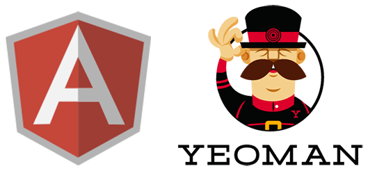

# Yeoman Generator for the AngularJS Next Generation



This generator is simple enough to create small reusable components (directives) and powerful enough to complete AngularJS applications.

## Install
```
$ npm install -g generator-angular-next
```

## Getting started

1. Scaffold the project:
```
$ yo angular-next
```

2. Then start the application:
```
$ gulp serve
```
3. Open your browser and access it at [http://localhost:8080/](http://localhost:8080/)

## Tasks
```serve``` Starts the web server

```
$ gulp serve
```

---


```tdd``` Starts Karma to watch your files and run the unit tests automatically

```
$ gulp tdd
```

## Subgenerators (coming soon)
```
$ yo angular-next:module [name]
$ yo angular-next:directive [name]
$ yo angular-next:factory [name]
$ yo angular-next:controller [name]
$ yo angular-next:view [name]
```

## Stack
- AngularJS
- Yeoman
- NodeJS
- Karma
- Jasmine
- Protractor
- Gulp

## Featues
- [x] Unit tests with Karma and Jasmine
- [x] E2E tests with Protractor
- [x] E2E tests with Protractor
- [ ] Authentication with OAuth or OpenID
- [ ] Authentication with OAuth or OpenID
- [ ] Generate Directives, Services, Controllers or Filters with the correspondent test files via Subgenerators
- [ ] Code coverage with Istanbul

## Motivation
The motivation behind this generator was the wish to DRY the proccess of configuring the necessary development environment for crafting small and modular components to be distributed on Bower or even entire applications.

## Team
[](https://github.com/cironunes) | 
--- |
[Ciro Nunes](https://github.com/cironunes) |

## License

MIT © Ciro Nunes
